# Warden

[](https://github.com/NoOneNoWhere1/warden-enforcer/actions/workflows/ci.yml)

Prompt-level guardrails ask agents to behave; Warden enforces at the Linux kernel. Each agent session runs behind per-session nftables rules inside a network namespace, so packets outside the session's credential are dropped at the kernel regardless of what the agent does or is told to do. Every violation becomes an Ed25519-signed breach event — Rekor-logged and turned into reputation and bond-ledger slashing by the clearing service when those layers are enabled.

---

## Architecture



The first diagram shows the full accountability stack — the target architecture; see [What is enforced today](#what-is-enforced-today) for which parts exist. An agent receives a ledger-anchored identity (slow path: DID registration) and a short-lived scoped credential (fast path: CIDR + tool + resource + intent claims). Every action the agent takes passes through a reference monitor split into two planes: a control plane (MCP server) that checks scope and signs logs, and an enforcement plane where the kernel blocks off-scope packets and the enforcer daemon signs the resulting breach events. In-scope traffic reaches allowlisted targets and is logged to a tamper-evident Merkle attestation log. Off-scope traffic is dropped at the kernel and emits a signed breach event that drives slashing in an optional economic bonding layer.



The second diagram zooms into the enforcement plane. An agent runs inside a sandboxed network namespace with no ambient route out. Every outbound packet hits a kernel firewall (nftables, or eBPF in future) whose allowlist is compiled from the session credential's `targets` CIDR list by a controller. In-scope packets are forwarded to allowlisted targets; off-scope packets are dropped and the kernel NFLOG subsystem notifies the enforcer, which constructs a signed breach event.

The enforcement-first argument: containment is placed below the agent process at the Linux kernel, not inside its prompt or its tool layer. A compromised or prompt-injected agent cannot talk its way past a kernel firewall. Detection and attribution are cryptographic side effects of the block itself — the enforcer signs each breach event with Ed25519, fsync's it to a JSONL spool, and submits its SHA-256-addressed canonical form to a Rekor transparency log, so the breach record exists and is tamper-evident even before any human reviews it.

---

## What is enforced today

Warden is a v0 working prototype. The claims below are exactly what the demo proves and CI gates.

| Layer | Enforced by | Mechanism | Status |
|---|---|---|---|
| **Network** (`targets`) | Go `warden-enforcer` | per-session nftables forward chain, default-drop; NFLOG → Ed25519-signed breach event → spool → Rekor | **ENFORCED TODAY** |
| **Tool** (`tools`) | MCP server (Python) | stored in the session credential | planned, not yet enforced |
| **Resource** (`resources`) | Retrieval API (.NET) | stored in the session credential | planned, not yet enforced |
| **Intent** (`intent`) | Orchestrator (Python) | stored in the session credential | planned, not yet enforced |

The unconditional deny list (`169.254.169.254/32`, `127.0.0.0/8`, `10.200.0.0/16`, `fd00:ec2::254/128`, `::1/128`, `fe80::/10`) is hard-coded before any `targets`-derived accept rules. No credential claim can override it.

Out of scope for v0: egress is scoped by IP, not content — application-layer exfiltration through an allowed CIDR, DNS-based egress (targets are raw CIDRs; there is no name-resolution story yet), and covert channels within permitted destinations are not addressed. [SECURITY.md](SECURITY.md) defines the bypass surface that is in scope.

---

## See it run


The full end-to-end run: a prompt-injected recon agent is blocked at the kernel, each violation is signed and logged to Rekor, and the clearing service slashes the agent's reputation and kills the session — the last frame is the honest tally of what's enforced today versus planned. This is the real demo, not a mockup; regenerate it with `vhs demo/gif/demo.tape`.

**Linux (Debian/Ubuntu)** (requires root, nftables, Go 1.26+):

```bash
./scripts/setup.sh        # installs Go, Python deps, kernel tools
```

Then follow [demo/README.md](demo/README.md) for the full run with Rekor.

**macOS** — Docker one-liner from [demo/README.md](demo/README.md):

```bash
docker run --rm -it --privileged \
    -v $(pwd):/warden -w /warden \
    ubuntu:24.04 bash -c \
    'apt-get update -q && apt-get install -y nftables iproute2 iputils-ping \
       curl ca-certificates python3 python3-pip && \
     curl -fsSL "https://go.dev/dl/go1.26.4.linux-$(dpkg --print-architecture).tar.gz" \
       | tar -C /usr/local -xz && \
     export PATH=/usr/local/go/bin:$PATH && \
     pip install --break-system-packages -r requirements-test.txt && \
     (cd enforcer && go build -o bin/warden-enforcer ./cmd/warden-enforcer) && \
     python3 demo/run_demo.py'
```

Example output (excerpted from the full run in demo/README.md):

```
  [3b] signed breach events (GET /sessions/{id}/events)
  PASS  breach events count  (2 events received)
  PASS  event[0] Ed25519 signature  (breach_id=a1b2c3d4...)
  PASS  event[1] Ed25519 signature  (breach_id=e5f6a7b8...)
  ...
  PASS  slash_event executed  (2 breach(es) slashed)
  PASS  agent reputation decremented  (100 → 80)
  PASS  session.terminated_at set  (clearing killed the session)
  PASS  enforcer session killed  (GET /sessions/{id}/events → 404)
```

---

## Future vision

The four enforcement layers in the table above converge on the same signed-attestation contract described in [docs/breach-event-canonicalization.md](docs/breach-event-canonicalization.md): every enforcement point, regardless of layer, emits a canonical Ed25519-signed event whose SHA-256 address is submitted to a Rekor transparency log. The network layer (v0, live today) proves the pattern works end-to-end. The tool, resource, and intent layers follow the same contract; their enforcers are the MCP server, retrieval API, and orchestrator respectively. None of these are implemented yet.

The bonding model (described in [docs/slashing-policy.md](docs/slashing-policy.md)) currently operates on reputation: `agent_identity.reputation_score` starts at 100 and decrements 10 per confirmed breach, with a parallel `operator_bond.amount_usd` bookkeeping entry. This is Path A — reputational accountability, appropriate for single-operator deployments. Path B extends slashing from reputation to capital (a custodian holds the bond; slash events trigger financial transfer); deferred until accountability claims are made to an external counterparty requiring financial recourse. Both paths share the same breach-event and Rekor infrastructure. (All bonding beyond Path A reputation: planned, not yet implemented.)

---

## Repository layout

```
enforcer/   Go daemon — per-session nftables rules, NFLOG monitoring, Ed25519 breach signing
demo/       end-to-end demo: rogue recon agent, enforcement assertions, clearing stage
clearing/   Python clearing service — breach confirmation, reputation slashing, session kill
docs/       architecture diagrams, enforcer wiki, slashing policy, canonicalization spec
scripts/    setup.sh (prereq bootstrap), install-enforcer.sh (systemd), smoke.sh, verify-parity.sh
tests/      phase-gate pytest suites (Go tests live in enforcer/)
infra/      Docker Compose — Rekor stack, Postgres
```

---

## Contributing

See [CONTRIBUTING.md](CONTRIBUTING.md) for dev setup, PR expectations, and where help is wanted.
Security issues (bypass reports, signature forgery) go to [SECURITY.md](SECURITY.md).

## License

Apache-2.0 — see [LICENSE](LICENSE).
