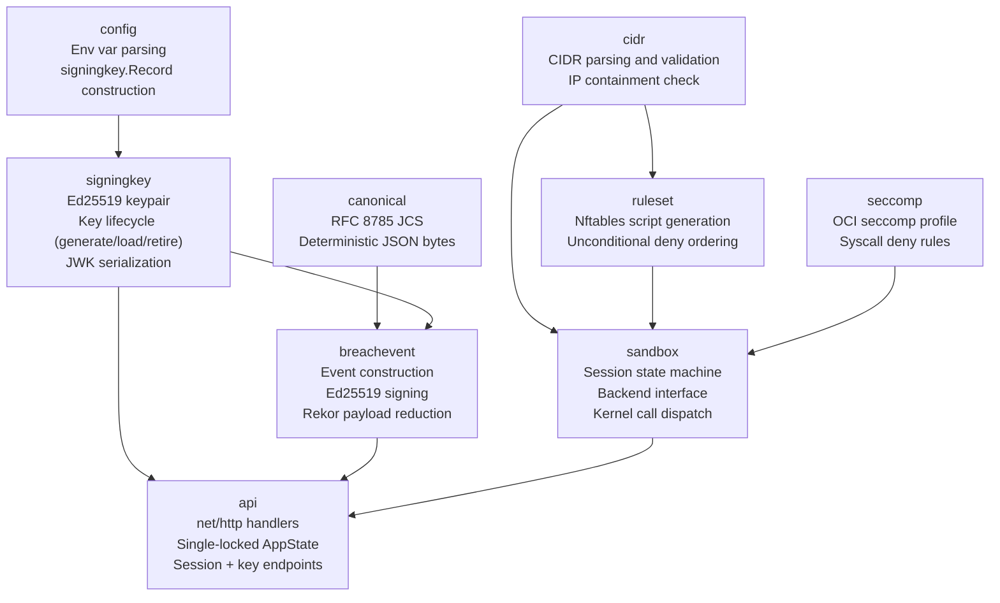
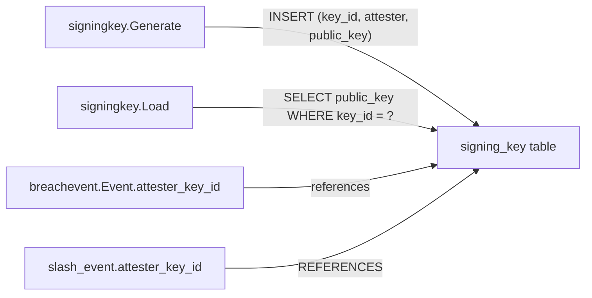
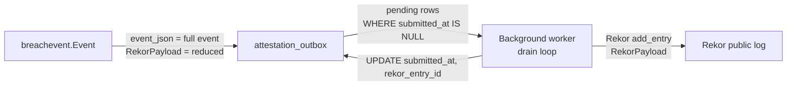
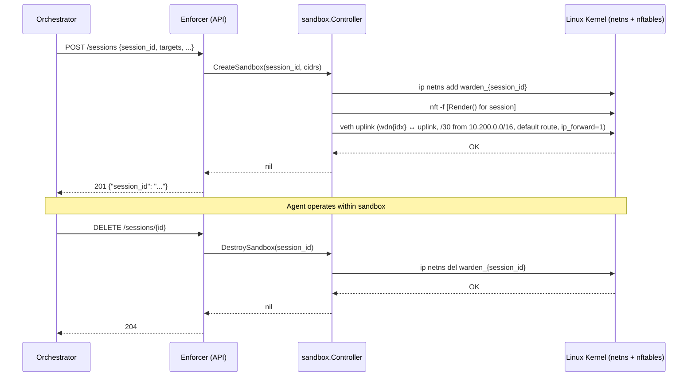
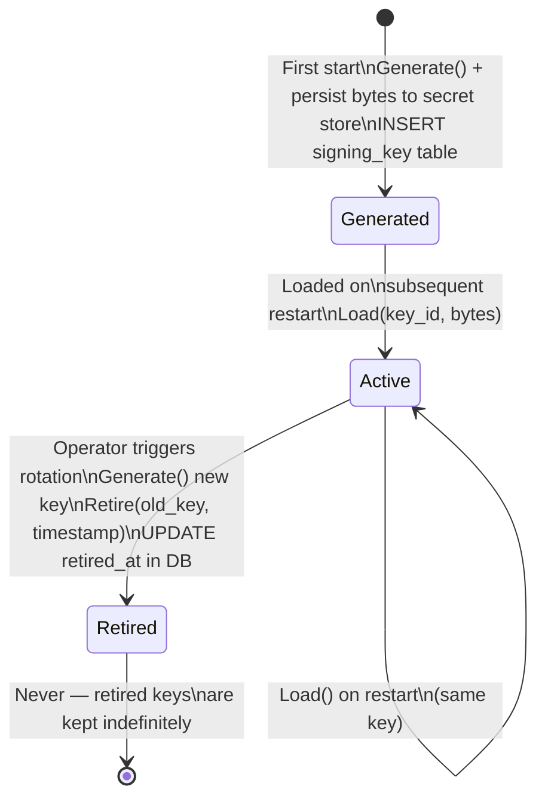

# Warden Enforcer — Module Wiki

**Component:** `enforcer/` (Go)
**Role:** Host-side daemon. Provides network-layer containment for agent sessions and produces cryptographically signed breach attestations.
**Runs as:** systemd service on the host machine, not inside Docker. Communicates with compose services via a Unix domain socket.

> **Provenance:** This document is regenerated from the Go source after the Rust→Go port (swap commit tagged `rust-enforcer-final` preserves the prior Rust tree). The port is parity-first: external contracts — wire formats, canonical breach-event bytes + Ed25519 signatures (RFC 8785 JCS), nftables rendering, and the Unix-socket HTTP API — are preserved exactly. Scope of what is and is not contract is declared in `enforcer/PARITY.md`; test-identity mapping in `enforcer/PARITY_LEDGER.md`.

---

## Table of Contents

1. [Why the Enforcer Exists](#1-why-the-enforcer-exists)
2. [Architecture Overview](#2-architecture-overview)
3. [Module Reference](#3-module-reference)
   - [cidr](#31-cidr)
   - [canonical](#32-canonical)
   - [signingkey](#33-signingkey)
   - [breachevent](#34-breachevent)
   - [ruleset](#35-ruleset)
   - [config](#36-config)
   - [seccomp](#37-seccomp)
   - [sandbox](#38-sandbox)
   - [api](#39-api)
4. [Database Interactions](#4-database-interactions)
5. [API Reference](#5-api-reference)
6. [Security Model](#6-security-model)
7. [Session Lifecycle](#7-session-lifecycle)
8. [Breach Event Flow](#8-breach-event-flow)
9. [Key Lifecycle](#9-key-lifecycle)
10. [Configuration Reference](#10-configuration-reference)
11. [Deployment and Operations](#11-deployment-and-operations)

---

## 1. Why the Enforcer Exists

Warden runs autonomous agents against live infrastructure. The security guarantee the product makes is *provable containment*: an agent cannot reach a host it was not explicitly authorized to reach, and any attempt to do so generates a tamper-evident signed record.

Software-only controls (prompt instructions, tool parameter validation, intent checking) are not sufficient on their own. An agent controlled by a malicious tool response, a compromised model output, or a prompt injection attack could bypass all software-layer controls and issue arbitrary network calls. The enforcer is the hardware-adjacent backstop: it enforces the containment policy at the Linux kernel level, where an agent process has no recourse.

The enforcer is not the only enforcement layer. Warden uses four:

| Layer | Enforced by | What it checks |
|---|---|---|
| **Network** | Enforcer (Go, this component) | Egress IPs vs `targets` OAuth claim |
| **Tool** | MCP server (Python) | Tool names vs `tools` claim |
| **Resource** | Retrieval API (.NET) | Resource identifiers vs `resources` claim |
| **Intent** | Orchestrator (Python) | Inferred intent vs `intent` claim |

The enforcer handles the network layer only. It is the most fundamental because it operates below the agent's runtime and cannot be bypassed by software running inside the sandbox.

---

## 2. Architecture Overview

### Package layout

The Go tree mirrors the original Rust modules 1:1 (`internal/<pkg>` ← `src/<mod>.rs`), ordered here by dependency (leaves first):

```
enforcer/
├── go.mod  go.sum  .golangci.yml  README.md
├── PARITY.md  PARITY_LEDGER.md          # parity contract + test-identity map
├── cmd/warden-enforcer/
│   ├── main.go                          # socket lifecycle, serve loop
│   ├── backend_linux.go                 # //go:build linux  → LinuxSandbox
│   └── backend_other.go                 # //go:build !linux → NoopBackend
├── internal/
│   ├── cidr/           # CIDR parse / containment / re-serialize
│   ├── canonical/      # RFC 8785 (JCS) canonical JSON
│   ├── signingkey/     # Ed25519 key lifecycle + JWK
│   ├── breachevent/    # event construct / sign / verify / Rekor payload
│   ├── ruleset/        # nftables script generation
│   ├── config/         # env-var configuration
│   ├── seccomp/        # OCI seccomp profile
│   ├── sandbox/        # session state machine + kernel backend
│   └── api/            # net/http handlers + AppState
└── tests/conformance/breach_event_v1.json   # immutable cross-language vector
```

### Module relationships



### Runtime topology

```
┌─────────────────────── Host machine ────────────────────────────┐
│                                                                  │
│  ┌─────────────────────────────────────────────────────────┐    │
│  │  warden-enforcer (systemd service, warden:warden user)  │    │
│  │                                                          │    │
│  │   config ──► AppState ──► net/http ServeMux             │    │
│  │                  │                                        │    │
│  │            sandbox.Controller                            │    │
│  │              └─ LinuxSandbox (ip netns + nft)           │    │
│  │                                                          │    │
│  │   Listens on: /run/warden-enforcer/api.sock (0660)      │    │
│  └─────────────────────────────────────────────────────────┘    │
│                         │                                        │
│         ┌───────────────┤  Unix socket bind mount               │
│         ▼               │                                        │
│  ┌──────────────┐  ┌────┴──────────┐  ┌──────────────┐         │
│  │ MCP server   │  │  Retrieval    │  │  Orchestrator │         │
│  │ (Python,     │  │  API (.NET,   │  │  (Python,     │         │
│  │  compose)    │  │   compose)    │  │   compose)    │         │
│  └──────────────┘  └───────────────┘  └──────────────┘         │
└─────────────────────────────────────────────────────────────────┘
```

The enforcer is not a compose service. Compose services call it via a bind-mounted Unix socket. There is no TCP port exposed; OS file permissions (`0660 warden:warden`) are the authentication mechanism. The HTTP layer is Go's standard-library `net/http` ServeMux (Go 1.22+ method-and-pattern routing) — no web framework.

---

## 3. Module Reference

### 3.1 `cidr`

**File:** `internal/cidr/cidr.go`
**Purpose:** Parse and validate CIDR notation strings; check whether an IP address falls within a CIDR block; re-serialize to the exact string form that feeds nftables `daddr` tokens.

This module is the data foundation for everything that deals with IP addresses: ruleset generation, sandbox creation, and future breach detection when an agent attempts a connection to an out-of-scope host. Because `String()` output is spliced directly into nft scripts, it is pinned byte-for-byte against the Rust `Display` implementation via `testdata/reserialization.json`.

#### `type Cidr`

Stores a validated `netip.Addr` and prefix length. The address family is preserved — a `Cidr` parsed from an IPv4 string will never match an IPv6 address, even a 4-in-6 mapped form.

Fields are unexported; consumers use `Addr()`, `PrefixLen()`, or `String()` (`"10.0.0.0/24"`).

#### Functions and methods

| Name | Signature | Description |
|---|---|---|
| `Parse` | `(s string) (Cidr, error)` | Parse a CIDR string. Rejects: missing `/`, empty address, invalid address, prefix length exceeding family maximum (32 IPv4, 128 IPv6). |
| `Contains` | `(ip netip.Addr) bool` | Returns `true` if `ip` falls within this block. Cross-family comparisons always return `false`. |
| `Addr` | `() netip.Addr` | The network address portion. |
| `PrefixLen` | `() uint8` | The prefix length. |
| `String` | `() string` | Canonical `addr/prefix` form; must match Rust `Display` byte-for-byte. |

#### Parity notes carried from Rust

- **Zone IDs rejected.** Rust's `IpAddr::parse` rejects zone-scoped addresses (`fe80::1%eth0`); `netip.ParseAddr` accepts them, so `Parse` rejects them explicitly (`// PARITY:`).
- **Leading `+` in prefix.** Rust parses the prefix as `u8`, which accepts one leading `+` (`10.0.0.0/+24` is valid); `strconv.ParseUint` rejects signs, so the parser strips a single leading `+` to match (`// PARITY:`).

#### How `Contains` works

`maskedEqual` compares the leading `prefixLen` bits of the network address and the candidate. A zero prefix matches everything, mirroring Rust's `checked_shl(...).unwrap_or(0)` all-zero mask.

```
network: 10.0.0.0  →  0x0A000000
mask:    /24        →  0xFFFFFF00
target:  10.0.0.5   →  0x0A000005

0x0A000000 & 0xFFFFFF00 = 0x0A000000
0x0A000005 & 0xFFFFFF00 = 0x0A000000  ← equal, so contained
```

The same bit-comparison applies to IPv6 over its 16-byte representation.

---

### 3.2 `canonical`

**File:** `internal/canonical/canonical.go`
**Purpose:** Produce RFC 8785 (JSON Canonicalization Scheme) bytes for any value — the deterministic serialization over which breach-event signatures are computed.

A signature is only reproducible if both signer and verifier agree on the exact bytes. `ToCanonicalBytes` guarantees that agreement across languages: it marshals the value to JSON, then runs it through `github.com/gowebpki/jcs` (the Go RFC 8785 implementation) to normalize key ordering, whitespace, number formatting, and string escaping.

#### Function

| Name | Signature | Description |
|---|---|---|
| `ToCanonicalBytes` | `(value any) ([]byte, error)` | Marshal `value` to JSON, then apply the JCS transform. Output is byte-identical to the Rust `serde_jcs` path. |

Cross-language parity is pinned two ways: `testdata/jcs_differential.json` (a corpus emphasizing the live divergence surface — control characters, non-ASCII, quotes, backslashes, emoji in free-text fields) and the frozen conformance vector `tests/conformance/breach_event_v1.json`, which is the final arbiter.

---

### 3.3 `signingkey`

**File:** `internal/signingkey/signingkey.go`
**Purpose:** Ed25519 signing key lifecycle — generation, persistence, reload, retirement, and JWK serialization.

The enforcer's signing key is the root of trust for all breach attestations. A breach event is only as trustworthy as the key that signed it. This module enforces the invariant that the key is never silently discarded on restart and is never deleted after rotation.

#### `type Record`

Unexported fields; all access is through methods.

| Field | Type | Notes |
|---|---|---|
| `keyID` | `string` | Stable UUID assigned at generation time. Referenced by `attester_key_id` in every breach event. |
| `priv` | `ed25519.PrivateKey` | 32-byte Ed25519 private key. |
| `createdAt` | `string` | ISO 8601 timestamp, set at construction. **PARITY:** `Load` also sets this to `now()` (a Rust load quirk carried verbatim); the field is never serialized in any API response. |
| `retiredAt` | `string` | Empty = active; a timestamp = retired but retained. |

#### Functions and methods

| Name | Signature | Description |
|---|---|---|
| `Generate` | `() (*Record, error)` | Generate a new keypair using OS randomness. Assign a UUIDv4 `keyID`. The 32-byte private key must be persisted to the secret store immediately — it is not stored on disk by this module. |
| `Load` | `(keyID string, privateKeyBytes *[32]byte) (*Record, error)` | Reconstruct a key record from a persisted 32-byte seed. Used on enforcer restart. Does NOT generate a new key; produces identical signatures as the original. |
| `Retire` | `(retiredAt string)` | Mark the key retired at the given ISO 8601 timestamp. Does not delete the key. |
| `KeyID` | `() string` | The stable `keyID`. |
| `IsActive` | `() bool` | `true` if `retiredAt` is empty. |
| `RetiredAt` | `() string` | The retirement timestamp, or `""`. |
| `PrivateKeyBytes` | `() [32]byte` | The raw 32-byte private seed. Persist this immediately after `Generate()`. |
| `PublicKeyJWK` | `() map[string]any` | OKP/Ed25519 JWK marshaled from a map so keys serialize alphabetically. Returned by `GET /enforcer/keys/active`. |
| `VerifyingKey` | `() ed25519.PublicKey` | The public key, for breach event verification. |
| `SigningKey` | `() ed25519.PrivateKey` | The private key, for breach event signing. |

#### JWK wire order (parity-critical)

`PublicKeyJWK` returns a `map[string]any`, and Go marshals map keys alphabetically — matching `serde_json` (which serializes alphabetically without the `preserve_order` feature). The active-key wire bytes are therefore `{"crv":…,"key_id":…,"kty":…,"x":…}`; a retired key adds `retired_at`, which sorts between `kty` and `x`. This ordering is pinned by a byte-golden test and re-checked by `scripts/smoke.sh`. Building the JWK from a struct in declaration order would silently diverge — hence the map.

#### Why keys are never deleted

Breach events reference `attester_key_id`. Third parties (including the Rekor verifier) must be able to retrieve the public key for any `key_id` ever used to sign an event. Deleting a key would make historical breach events unverifiable. The `retiredAt` timestamp signals that the key is no longer active while preserving verifiability.

---

### 3.4 `breachevent`

**File:** `internal/breachevent/breachevent.go`
**Purpose:** Construct, sign, verify, and produce Rekor payloads for network-layer breach attestations.

A breach event is the permanent record of an agent attempting an action outside its OAuth scope. For the enforcer, that means an egress connection attempt to an IP not in the `targets` claim. The event is signed with the enforcer's Ed25519 key, persisted to a local fsync'd outbox spool (the Postgres `attestation_outbox` gains its writer in a later phase — the enforcer stays DB-free per the E3 plan), and submitted to Rekor in reduced form as a `rekord` entry carrying a dedicated second signature over the canonical reduced payload (Rekor's `hashedrekord` type does not accept pure Ed25519 — sigstore/rekor #851).

#### `type Event`

Fields are exported with explicit `json` tags. Field order in the struct is irrelevant to the signature — canonicalization (JCS) imposes the byte order.

| Field (JSON) | Type | Notes |
|---|---|---|
| `agent_id` | `string` | The agent that triggered the breach. |
| `attester` | `string` | Always `"warden-enforcer"` for network-layer events. |
| `attester_key_id` | `string` | References the `signing_key` table `key_id`. Never the raw JWK. |
| `breach_id` | `string` | UUIDv4, unique per event. |
| `layer` | `string` | Always `"network"` for the enforcer. |
| `session_id` | `string` | The session in which the breach occurred. |
| `signature` | `string` | Base64url-encoded Ed25519 signature. Empty until `Sign` is called. |
| `timestamp` | `string` | ISO 8601 UTC timestamp. |
| `token_claim` | `string` | Always `"targets"` — the OAuth claim that was violated. |
| `violation` | `string` | Human-readable description. **Not included in the Rekor payload.** |

#### Functions and methods

| Name | Signature | Description |
|---|---|---|
| `New` | `(sessionID, agentID, violation, attesterKeyID string) *Event` | Construct an unsigned event. `breach_id` is generated fresh; `signature` is empty. Call `Sign` before storing. |
| `Sign` | `(signingKey ed25519.PrivateKey) error` | Compute the Ed25519 signature over `signableBytes()` and store it base64url-encoded in `Signature`. |
| `Verify` | `(verifyingKey ed25519.PublicKey) bool` | Verify the signature. Returns `false` if the signature is missing, not valid base64url, not 64 bytes, or mathematically invalid — never panics. |
| `RekorPayload` | `() map[string]any` | Reduced map safe for the public Rekor log. Excludes `violation` and `token_claim`. |
| `signableBytes` (private) | `() ([]byte, error)` | Marshal the event, drop the `signature` key, and run `canonical.ToCanonicalBytes`. |

#### Canonical signing

The signature covers all fields **except** `signature` itself. `signableBytes` does exactly:

1. `json.Marshal(e)` → raw JSON
2. Unmarshal into `map[string]any`, `delete(fields, "signature")`
3. `canonical.ToCanonicalBytes(fields)` → RFC 8785 (JCS) bytes

```
Signed bytes = JCS({
  "agent_id": "...",
  "attester": "warden-enforcer",
  "attester_key_id": "...",
  "breach_id": "...",
  "layer": "network",
  "session_id": "...",
  "timestamp": "...",
  "token_claim": "targets",
  "violation": "..."
})
```

**Note:** `violation` IS included in the signed bytes even though it is excluded from the Rekor payload. Any tampering with the violation description invalidates the signature, even though Rekor never sees it. This is pinned by the conformance vector, which is byte-identical to the Rust output.

#### Rekor data classification

| Field | Full event (local outbox spool) | Rekor payload |
|---|---|---|
| `breach_id` | ✓ | ✓ |
| `session_id` | ✓ | ✓ |
| `agent_id` | ✓ | ✓ |
| `layer` | ✓ | ✓ |
| `timestamp` | ✓ | ✓ |
| `attester` | ✓ | ✓ |
| `attester_key_id` | ✓ | ✓ |
| `signature` | ✓ | ✓ |
| `violation` | ✓ | **excluded** (customer-sensitive) |
| `token_claim` | ✓ | **excluded** |

The `violation` field contains the literal attempted destination. Publishing it to a public transparency log would expose customer infrastructure topology.

> **Resolved at E3 planning (3 July 2026):** timestamp fractional-second formatting. `New` uses a fixed second-precision layout with a `+00:00` offset; live events therefore diverge from chrono's variable fractional seconds but round-trip within Go. Council verdict: leave as-is, do not re-freeze the conformance vector.

---

### 3.5 `ruleset`

**File:** `internal/ruleset/ruleset.go`
**Purpose:** Generate complete nftables scripts for a session's network isolation.

A `Ruleset` represents the firewall rules for one agent session. `Render()` produces an nft script that can be piped directly to `nft -f` inside the session's namespace. Table names embed the session ID, so multiple sessions coexist on the same host without collision.

#### `type Ruleset`

| Field | Type | Description |
|---|---|---|
| `sessionID` | `string` | Used to generate table names. Hyphens replaced with underscores (nftables identifiers cannot contain hyphens). |
| `targets` | `[]cidr.Cidr` | CIDRs from the agent's `targets` claim. These become the `accept` rules, split by family. |

#### Functions and methods

| Name | Signature | Description |
|---|---|---|
| `New` | `(sessionID string, targets []cidr.Cidr) *Ruleset` | Construct a ruleset. No validation — call `cidr.Parse` before constructing. |
| `Render` | `() string` | Produce the complete nft script. See layout below. |
| `tableName` (private) | `() string` | `"warden_" + sessionID` with `-` replaced by `_`. |

#### Rendered script layout

For each family the script uses an **atomic replace idiom**: declare the table, delete it, then recreate it fully. The leading declaration makes the delete safe on the very first apply (deleting a non-existent table would error). This is a security-relevant ordering — the delete-precedes-redefinition property is a protected parity test.

```
table ip warden_{session_id} { }
delete table ip warden_{session_id}
table ip warden_{session_id} {
    chain forward {
        type filter hook forward priority 0; policy drop;
        ip daddr 169.254.169.254/32 drop      # metadata (unconditional)
        ip daddr 127.0.0.0/8 drop             # loopback (unconditional)
        ct state established,related accept    # return traffic
        ip daddr 10.0.0.0/24 accept            # targets-derived (IPv4)
    }
    chain postrouting {
        type nat hook postrouting priority srcnat; policy accept;
        masquerade
    }
}
table ip6 warden_{session_id} { }
delete table ip6 warden_{session_id}
table ip6 warden_{session_id} {
    chain forward {
        type filter hook forward priority 0; policy drop;
        ip6 daddr fd00:ec2::254/128 drop       # metadata (unconditional)
        ip6 daddr ::1/128 drop                 # loopback (unconditional)
        ip6 daddr fe80::/10 drop               # link-local (unconditional)
        ct state established,related accept
        ip6 daddr fd00::/48 accept             # targets-derived (IPv6)
    }
}
```

Key properties of the rendered script:

- **`forward` hook, not `output`.** The enforcer filters packets *forwarded* from the session namespace's guest through the uplink — it is a router for the sandbox, not the origin of the traffic. The gate test `test_egress_filter_uses_forward_hook` pins this.
- **`policy drop`** — the default action for the forward chain is to drop; nothing egresses unless a later rule accepts it.
- **Unconditional deny first**, before any accept (see ordering guarantee).
- **`ct state established,related accept`** — return packets for an already-permitted connection have the *guest* as their destination, not a target CIDR, so without this the default-drop policy would discard every reply and no connection would ever complete.
- **IPv4 `postrouting` NAT `masquerade`** — rewrites the guest's private source address to the namespace uplink so accepted egress is routable and replies return. Forwarding without NAT leaves accepted packets unanswerable.
- **IPv6 is filter-only (no NAT).** The v1 session namespace has no IPv6 uplink; the IPv6 table exists purely to contain (default-deny forward) so that a target expressed as IPv4 cannot be reached over IPv6.

#### Ordering guarantee

Unconditional deny rules are always emitted **before** any `accept` rule. This is critical: if an operator issues a credential with `targets: ["169.254.0.0/16"]` — intentionally or via injection — the metadata endpoint at `169.254.169.254` remains blocked. nftables processes rules top-to-bottom and stops at the first match; the earlier deny wins. `test_metadata_ip_is_blocked_even_when_inside_allowed_cidr` protects this.

#### Unconditional deny ranges

Hard-coded in package-level slices; cannot be overridden by any `targets` claim:

**IPv4** — `169.254.169.254/32` (cloud instance metadata: AWS/GCP/Azure), `127.0.0.0/8` (loopback).
**IPv6** — `fd00:ec2::254/128` (AWS EC2 metadata over IPv6), `::1/128` (loopback), `fe80::/10` (link-local).

#### Why dual-stack is required

A target specified as an IPv4 CIDR does not prevent a connection to the same host over IPv6. Both tables are always emitted together in the same `nft -f` call, and the IPv6 table always contains the unconditional deny rules even when the session has no IPv6 targets. This closes the dual-stack bypass.

---

### 3.6 `config`

**File:** `internal/config/config.go`
**Purpose:** Parse and validate enforcer startup configuration from environment variables.

#### Error types

| Type | When |
|---|---|
| `MissingError{Key}` | A required environment variable is not set. `Key` is the variable name. |
| `InvalidError{Msg}` | A variable is set but its value is malformed. `Msg` explains the problem. |

#### `type Config`

| Field | Type | Source |
|---|---|---|
| `SigningKey` | `*signingkey.Record` | Constructed from `ENFORCER_KEY_ID` + `ENFORCER_SIGNING_KEY`. |
| `Port` | `uint16` | `ENFORCER_PORT`, default `9090`. **PARITY:** validated but never bound — the API listens on the Unix socket only. Field carried verbatim from Rust. |
| `SocketPath` | `string` | `ENFORCER_SOCKET`, default `/run/warden-enforcer/api.sock`. |

#### Functions

| Name | Signature | Description |
|---|---|---|
| `FromEnv` | `() (*Config, error)` | Load from the real process environment (`os.LookupEnv`). |
| `FromLookup` | `(lookup func(string) (string, bool)) (*Config, error)` | Load from an injectable lookup. Tests pass a closure returning controlled values without touching the process environment or requiring serialized test execution. |

#### `FromLookup` parse sequence

```
ENFORCER_KEY_ID          → missing? → MissingError
ENFORCER_SIGNING_KEY     → missing? → MissingError
                         → invalid base64url? → InvalidError
                         → decoded length ≠ 32? → InvalidError
                         → signingkey.Load() → SigningKey field

ENFORCER_PORT            → absent? → default 9090
                         → not parseable / > 65535? → InvalidError
                         → cast to uint16 → Port field

ENFORCER_SOCKET          → absent? → default /run/warden-enforcer/api.sock
                         → value → SocketPath field
```

**PARITY:** `parsePort` strips one leading `+` before parsing, mirroring Rust's `u32::from_str` (which accepts `+9090`) where `strconv.ParseUint` would reject the sign — the same quirk as the CIDR prefix parser.

---

### 3.7 `seccomp`

**File:** `internal/seccomp/seccomp.go`
**Purpose:** Define the OCI-compatible seccomp-bpf profile applied to agent processes inside the sandbox.

nftables controls network egress. Seccomp controls what syscalls the agent process is permitted to make. Together they form two independent enforcement layers: nftables stops outbound packets at the kernel network stack; seccomp stops privilege escalation attempts before they can subvert the namespace.

> **Wiring status:** the profile is a builder consumed by the sandbox runtime (runsc/gVisor) at the placement step, which is future work. Today it has unit-test coverage only — the same state as the Rust implementation at port time.

#### Types

| Type | Description |
|---|---|
| `Action` (`ActionAllow` / `ActionErrno`) | `"SCMP_ACT_ALLOW"` (permit) / `"SCMP_ACT_ERRNO"` (return errno). |
| `SyscallArg` | Argument-level constraint: `Index` (0-based position), `Value`, `Op` (e.g. `"SCMP_CMP_EQ"`). |
| `SyscallRule` | A set of syscall `Names` sharing an `Action`, an optional `ErrnoRet` (`*int32`, omitted when nil), and an optional `Args` list. |
| `Profile` | Top-level OCI structure: `DefaultAction` + `Syscalls` list. Serializes to OCI-runtime-spec-compatible JSON. |

#### `DefaultProfile() Profile`

Returns the enforcer's standard profile (`DefaultAction: ActionAllow`). Safe to build on any platform; application to a process is Linux-only.

**Rule 1 — namespace and privilege syscalls** → `SCMP_ACT_ERRNO`, errno 1 (`EPERM`):

| Syscall | Why blocked |
|---|---|
| `ptrace` | Inspect/control another process — could escape the sandbox init. |
| `mount` | Modify the filesystem namespace — could bind-mount host paths in. |
| `unshare` | Create new kernel namespaces — could make a network namespace that bypasses nftables. |
| `setns` | Join an existing namespace — could join the host network namespace directly. |

**Rule 2 — raw socket creation** → `SCMP_ACT_ERRNO`, errno 1, constrained to `Args: [{Index: 1, Value: 3, Op: "SCMP_CMP_EQ"}]`:

`socket(domain, type, protocol)` with `type == SOCK_RAW` (value 3) is blocked. TCP (`SOCK_STREAM`) and UDP (`SOCK_DGRAM`) are unaffected. `SOCK_RAW` allows crafting arbitrary IP packets that bypass normal routing and would circumvent the nftables forward chain.

#### Why `SCMP_ACT_ERRNO` not `SCMP_ACT_KILL`

`KILL` would hard-terminate the agent the moment it attempts a blocked syscall. That is undesirable: (1) the MCP layer must emit a breach event before the agent exits — an immediate kill races that; (2) a hard kill makes debugging harder. `ERRNO` returns `EPERM`, giving the process a chance to surface an error before the session is torn down cleanly.

#### `Denies(syscall string) bool`

Returns `true` if `syscall` appears in any deny rule's `Names`. For the `socket` rule, `Denies("socket")` is `true` even though only `SOCK_RAW` is blocked — the arg constraint narrows the rule but is not reflected in `Denies`.

---

### 3.8 `sandbox`

**File:** `internal/sandbox/sandbox.go` (+ `backend_linux.go`, `//go:build linux`)
**Purpose:** Session state machine and dispatch layer for kernel-level sandbox operations.

This package sits between the HTTP API and the Linux kernel. It tracks which sessions are active in memory and delegates actual isolation operations to a pluggable `Backend`. This separation lets unit tests run on any platform (including macOS) while the real Linux backend is exercised only in the CI linux-gate.

#### Error types

| Type | When |
|---|---|
| `AlreadyExistsError{SessionID}` | `CreateSandbox` called for a session already active. |
| `NotFoundError{SessionID}` | `DestroySandbox` called for a session not active. |
| `BackendError{Msg}` | The kernel operation failed (`ip netns`, `nft`); `Msg` carries shell-out stderr where available. |

#### `type Backend` (interface)

```
Backend
├── Create(sessionID string, cidrs []cidr.Cidr) error
│       Creates a network namespace for the session and applies the
│       rendered nftables rules (default-deny forward; accept only listed CIDRs).
│
└── Destroy(sessionID string) error
        Tears down the network namespace and removes its nftables tables.
```

#### Implementations

| Type | Platform | Use |
|---|---|---|
| `NoopBackend` | Any | Unit tests, the dev-Mac smoke test, and non-Linux hosts. |
| `LinuxSandbox` | Linux (`//go:build linux`) | Production. Shells out to `ip netns add/del`, pipes the rendered script to `nft -f` inside the namespace, then provisions the veth uplink (M13): host `wdn<idx>` ↔ ns `uplink`, a per-session /30 from `10.200.0.0/16`, default route, `ip_forward=1`. Rules are programmed *before* the uplink comes up — the namespace is never routable without enforcement. Deleting the namespace destroys the veth pair; only the subnet index needs freeing. |

`LinuxSandbox` shells out with `os/exec`, interpolating the session ID into `ip netns` and the namespace name exactly as the Rust backend did. The subprocess and mode-bit call sites carry `//nolint:gosec` (G204/G302/G306) with justification comments: they are parity-preserving by design, not defects to "fix" — adding input validation the Rust code lacks would be a parity break. (runsc/gVisor placement is invoked by the orchestrator, not by sandbox creation here.)

#### `type Controller`

Holds the backend and an in-memory `active map[string]struct{}` of session IDs. The active set is the controller's only state — the backend owns the kernel-side state.

> **Concurrency (parity mandate):** the `Controller` deliberately has **no** mutex. Rust nested the controller inside a single `Arc<Mutex<AppState>>`; the Go `api` package mirrors that with one `sync.Mutex` on `AppState`. A second lock here would invent lock-ordering questions the Rust code never had. See §3.9.

#### Functions and methods

| Name | Signature | Description |
|---|---|---|
| `NewController` | `(backend Backend) *Controller` | Construct with a backend; the active set starts empty. |
| `CreateSandbox` | `(sessionID string, cidrs []cidr.Cidr) error` | Returns `AlreadyExistsError` if already active. Else calls `backend.Create`; on success inserts into the active set. **On backend failure the session is NOT marked active.** |
| `DestroySandbox` | `(sessionID string) error` | Returns `NotFoundError` if not active. Else calls `backend.Destroy`; on success removes from the active set. **On backend failure the session REMAINS active** — the operator must retry. |
| `IsActive` | `(sessionID string) bool` | Whether the session is in the active set. |
| `ActiveCount` | `() int` | Number of currently active sessions. |

#### State machine

```mermaid
stateDiagram-v2
    [*] --> Absent : initial state

    Absent --> Active : CreateSandbox() + backend.Create() OK
    Absent --> Absent : CreateSandbox() + backend.Create() FAILS\n(never marked active)
    Absent --> Error_NotFound : DestroySandbox()

    Active --> Active : CreateSandbox()\n→ AlreadyExists error
    Active --> Absent : DestroySandbox() + backend.Destroy() OK
    Active --> Active : DestroySandbox() + backend.Destroy() FAILS\n(remains active; operator must retry)
```



#### Why backend failure on destroy retains active state

If `backend.Destroy()` fails, the kernel-side namespace and nftables rules are in an unknown state — they may still exist. Removing the session from the active set would make the controller believe the session is gone while isolation rules may still be partially applied; a later `CreateSandbox` with the same ID could then create a conflicting namespace. Retaining active state forces the operator to investigate and explicitly retry. `backend_error_on_destroy_is_propagated` protects this.

---

### 3.9 `api`

**File:** `internal/api/api.go`
**Purpose:** `net/http` handlers, shared application state, and the route table.

This is the HTTP surface of the enforcer. All routes are internal-only — served on a Unix socket, not a TCP port. Routing is Go 1.22+ `ServeMux` method-and-pattern matching (`"POST /sessions"`, `"DELETE /sessions/{id}"`); there is no web framework.

#### `type Credential`

The body of `POST /sessions`. The enforcer uses only `targets` to program firewall rules; other claims are validated by their respective layers.

| Field (JSON) | Type | Used by enforcer |
|---|---|---|
| `session_id` | `string` | ✓ |
| `agent_id` | `string` | ✓ (stored for breach events) |
| `targets` | `[]string` | ✓ (parsed to `cidr.Cidr`, drives nftables rules) |
| `tools` | `[]string` | Stored; validated by MCP server |
| `resources` | `[]string` | Stored; validated by Retrieval API |
| `intent` | `string` | Stored; validated by orchestrator |
| `ttl_secs` | `uint64` | Stored; TTL expiry is future work |

Decoding uses an internal pointer-fielded struct (`*string`, `*[]string`, `*uint64`): all seven fields are required, so any nil after unmarshal — or any `json.Unmarshal` error — yields **422**. `DisallowUnknownFields` is deliberately *not* used (axum ignored extra fields, so Go does too).

#### `type AppState`

> **Single-lock mandate (parity):** one `sync.Mutex` guards the entire `AppState`, including the nested `Controller`, mirroring Rust's `Arc<Mutex<AppState>>`. Every handler takes the lock once at entry and holds it for the whole operation. There is no second lock anywhere.

| Field | Type | Notes |
|---|---|---|
| `mu` | `sync.Mutex` | The single lock over everything below. |
| `ActiveKey` | `*signingkey.Record` | The current signing key. |
| `ArchivedKeys` | `[]*signingkey.Record` | Retired keys, kept for `GET /enforcer/keys/{key_id}` lookups. |
| `Sessions` | `map[string]Credential` | Active sessions by `session_id`. |
| `Events` | `map[string][]breachevent.Event` | Signed breach events per session, ring-capped at 256 (oldest evicted). Populated by the emission pipeline (E3). |
| `EventLosses` | `map[string]uint64` | Per-session lost-event count (ring evictions, token-bucket rejections, failed spool appends); surfaced with the sandbox channel-overflow count as `X-Warden-Lost-Events`. |
| `Sandbox` | `*sandbox.Controller` | Session state machine + kernel backend. |
| `Outbox` | `*outbox.Spool` | Durable fsync'd JSONL attestation spool, written write-ahead of Rekor. |

#### Route table

| Method | Pattern | Handler |
|---|---|---|
| `POST` | `/sessions` | `createSession` |
| `DELETE` | `/sessions/{id}` | `deleteSession` |
| `GET` | `/sessions/{id}/events` | `getSessionEvents` |
| `GET` | `/enforcer/keys/active` | `getActiveKey` |
| `GET` | `/enforcer/keys/{key_id}` | `getKeyByID` |

#### Handler behavior

**`createSession`** — `POST /sessions`. Decode → lock → then, **in this exact order** (contract):

1. Decode failure or any nil required field → **422**.
2. `session_id` already in `Sessions` → **409** (this check precedes CIDR parsing).
3. Parse each `targets` entry; any invalid CIDR → **422**.
4. `Sandbox.CreateSandbox(...)`; `AlreadyExistsError` → **409**, `BackendError` → **500**.
5. Insert into `Sessions`, initialize `Events[id] = []`, return **201** `{"session_id": "..."}`.

The order is a parity contract: a request that is *both* a duplicate `session_id` and has a bad CIDR returns **409**, not 422, because the duplicate check runs first. An explicit test pins this.

**`deleteSession`** — `DELETE /sessions/{id}`. Lock → then:

1. Not in `Sessions` → **404** (the sandbox is not consulted first).
2. `Sandbox.DestroySandbox(id)`; a `NotFoundError` from the controller is treated as success (the record still gets removed); a `BackendError` → **500** and the session record is **left in place** so the operator can retry.
3. On success remove from `Sessions` and `Events`, return **204**.

**`getSessionEvents`** — `GET /sessions/{id}/events`. Not found → **404**; otherwise **200** with a JSON array (a nil slice is normalized to `[]`, never `null`).

**`getActiveKey`** — `GET /enforcer/keys/active`. Returns the active key's OKP JWK with `key_id` added, keys alphabetical:
```json
{"crv":"Ed25519","key_id":"<uuid>","kty":"OKP","x":"<base64url>"}
```

**`getKeyByID`** — `GET /enforcer/keys/{key_id}`. Checks `ActiveKey` first, then `ArchivedKeys`; **404** if unknown. Retired keys include `retired_at` (which sorts between `kty` and `x`).

> **Parity — status codes are contract, body text is not.** axum's serde-generated 400 (malformed JSON) and 415 (bad Content-Type) both collapse to **422** in Go, with a Go-native `{"error": msg}` body. The gate asserts status codes only; error text is explicitly out of scope (`PARITY.md`).

---

## 4. Database Interactions

The enforcer interacts with two tables defined in `infra/migrations/001_initial_schema.sql`. Database writes are not yet wired — and per the E3 plan (council-locked 3 July 2026) the enforcer stays DB-free: signed events go to a local fsync'd JSONL spool, and `attestation_outbox` gains its writer in a later phase from a DB-speaking component that picks up the spool. The schema is described here for completeness.

### `signing_key` table

```sql
CREATE TABLE signing_key (
    key_id      TEXT PRIMARY KEY,
    attester    TEXT NOT NULL,      -- 'warden-enforcer'
    public_key  JSONB NOT NULL,     -- OKP JWK
    created_at  TIMESTAMPTZ DEFAULT now(),
    retired_at  TIMESTAMPTZ         -- NULL = active
);
```



**Enforcer interactions:** first start → `Generate()` then INSERT with `attester = 'warden-enforcer'`; restart → `Load()` using `key_id` from `ENFORCER_KEY_ID`; rotation → INSERT new row, UPDATE old row `SET retired_at = now()`; never DELETE — `retired_at` is the tombstone.

### `attestation_outbox` table

```sql
CREATE TABLE attestation_outbox (
    id             BIGSERIAL PRIMARY KEY,
    event_json     JSONB NOT NULL,
    attester       TEXT NOT NULL,
    created_at     TIMESTAMPTZ DEFAULT now(),
    submitted_at   TIMESTAMPTZ,      -- NULL = pending
    rekor_entry_id TEXT
);
CREATE INDEX ON attestation_outbox (submitted_at) WHERE submitted_at IS NULL;
```



**Why the outbox pattern?** A crash between writing the breach event and confirming Rekor submission would lose the event. The outbox writes the full event to the database in the same transaction as the session state change; if the enforcer crashes before the drain runs, the event survives and is submitted on the next restart. Rekor submission can fail transiently without losing the local record. `event_json` stores the complete event including `violation`; the worker calls `RekorPayload()` to strip sensitive fields before submitting to the public log.

---

## 5. API Reference

All endpoints are served on the Unix domain socket at `/run/warden-enforcer/api.sock`.

### `POST /sessions`

Register an agent session and program network isolation rules.

**Request body:**
```json
{
  "session_id": "sess-uuid-v4",
  "agent_id":   "agent-001",
  "targets":    ["10.0.0.0/24", "192.168.1.0/28"],
  "tools":      ["nmap_scan", "port_probe"],
  "resources":  ["db:vuln_kb"],
  "intent":     "recon",
  "ttl_secs":   3600
}
```

| Status | Meaning |
|---|---|
| 201 | Session created. Body: `{"session_id": "..."}` |
| 409 | Session ID already registered (checked before CIDR validation). |
| 422 | Body malformed, a required field missing, or a target CIDR invalid. |
| 500 | Sandbox backend failure (kernel operation failed). |

### `DELETE /sessions/{id}`

Tear down a session and remove its network isolation rules.

| Status | Meaning |
|---|---|
| 204 | Session removed. |
| 404 | Session not found. |
| 500 | Backend teardown failed; the session record is preserved for retry. |

### `GET /sessions/{id}/events`

Retrieve signed breach events for a session.

| Status | Meaning |
|---|---|
| 200 | Body: JSON array of events (currently always empty). |
| 404 | Session not found. |

### `GET /enforcer/keys/active`

Retrieve the active signing public key (keys serialize alphabetically):

```json
{"crv":"Ed25519","key_id":"<uuid>","kty":"OKP","x":"<base64url-32-byte-public-key>"}
```

### `GET /enforcer/keys/{key_id}`

Retrieve any signing key (active or retired) by its stable `key_id`.

| Status | Meaning |
|---|---|
| 200 | JWK response. Retired keys include `"retired_at": "<ISO 8601>"`. |
| 404 | Unknown `key_id`. |

---

## 6. Security Model

The enforcer applies defense-in-depth at two independent kernel layers. An agent process cannot bypass containment by compromising one layer alone.

```
Agent process
     │
     ▼
┌─────────────────────────────────────────────────────────┐
│  Layer 1: seccomp-bpf                                   │
│  Applied per-process via OCI runtime config             │
│  Blocks: ptrace, mount, unshare, setns, SOCK_RAW        │
│  Effect: prevents namespace escape, raw packet crafting │
└─────────────────────────────────────────────────────────┘
     │ (syscall passes seccomp filter)
     ▼
┌─────────────────────────────────────────────────────────┐
│  Layer 2: nftables forward chain (per session netns)    │
│  Policy: drop by default                                │
│  Rules: unconditional deny first, then ct established,   │
│         then accept targets-claim CIDRs only            │
│  IPv4 egress source-NAT'd (masquerade); IPv6 filter-only │
│  Effect: all egress dropped unless explicitly allowed   │
└─────────────────────────────────────────────────────────┘
     │ (packet matches an accept rule)
     ▼
  Network egress to authorized target
```

**Why both layers?**

| Attack | Stopped by seccomp | Stopped by nftables |
|---|---|---|
| Agent calls `socket(SOCK_RAW)` to craft raw IP packets | ✓ | — |
| Agent calls `unshare()` to create a new network namespace | ✓ | — |
| Agent calls `setns()` to join the host namespace | ✓ | — |
| Agent makes a normal TCP connection to an unauthorized IP | — | ✓ |
| Agent is redirected to a metadata IP | — | ✓ (unconditional deny) |
| Agent credential claims `targets: ["169.254.0.0/16"]` | — | ✓ (unconditional deny precedes accept) |
| Agent tries to reach an IPv4 target over IPv6 | — | ✓ (IPv6 table is default-deny) |

---

## 7. Session Lifecycle



---

## 8. Breach Event Flow

This flow triggers when a packet from an agent process is dropped by the session's nftables forward chain. The emission pipeline is the E3 milestone (design council-locked 3 July 2026), delivered across E3.1–E3.4 and gated end-to-end against a real Rekor log.

```mermaid
sequenceDiagram
    participant A as Agent process
    participant K as Kernel (nftables + NFLOG)
    participant L as nflog listener (per session, inside netns)
    participant C as Consumer (main-owned)
    participant S as Outbox spool (JSONL, fsync'd)
    participant R as Rekor

    A->>K: connect(1.2.3.4:443) — not in targets
    K-->>A: packet dropped (trailing catch-all log → policy drop)
    K->>L: NFLOG group 1, prefix "warden:<sid>:"
    L->>C: Drop{session, src, dst, port, proto, time}\nvia shared bounded channel (raw facts only — no key in the netns goroutine)
    C->>C: construct + Sign() under the AppState lock;\nappend to session ring buffer (events API)
    C->>S: append + fsync — before any Rekor attempt
    S->>R: POST rekord (second signature over\ncanonical reduced payload — no violation field)
    R-->>S: rekor entry id → fsync'd checkpoint watermark
```

Losses at any stage (channel drop, ring eviction, per-session token-bucket rate limit) are counted and surfaced in the events API — attestation is best-effort with a visible loss counter.

**Session-kill-on-breach:** a confirmed breach is intended to trigger immediate session termination so the breaching agent does not continue operating. This is **not in E3 scope** — it is scheduled with the Phase 4 orchestrator (A3 gate) unless explicitly pulled forward.

---

## 9. Key Lifecycle



**Restart behavior:** the enforcer reads `ENFORCER_KEY_ID` and `ENFORCER_SIGNING_KEY` from the environment. `signingkey.Load()` reconstructs the keypair from the 32-byte seed. The same keypair produces identical signatures — breach events signed before a restart remain verifiable after it.

**Rotation:** operator-triggered (not automated). The old key is retired (`retired_at` set in the database), but the key bytes and DB row are retained forever. Any verifier can retrieve the public key via `GET /enforcer/keys/{key_id}` and verify signatures from the retired key's active period.

---

## 10. Configuration Reference

| Variable | Required | Default | Description |
|---|---|---|---|
| `ENFORCER_KEY_ID` | Yes | — | The `key_id` of the active signing key (UUID string). Must match a row in the `signing_key` table. |
| `ENFORCER_SIGNING_KEY` | Yes | — | Base64url-encoded 32-byte Ed25519 private key seed. Persisted by the operator when `Generate()` was called. |
| `ENFORCER_PORT` | No | `9090` | Validated (0–65535) but never bound — the API listens on the Unix socket only. Field carried verbatim from the Rust implementation. |
| `ENFORCER_SOCKET` | No | `/run/warden-enforcer/api.sock` | Path to the Unix domain socket. Must be writable by the `warden` user. |

**Handling missing or invalid values:** `config.FromEnv()` returns a `MissingError` for absent required variables and an `InvalidError` with a descriptive message for malformed values. `main` prints the error to stderr and exits with code 1 on any config failure — the service will not start in a partially configured state.

---

## 11. Deployment and Operations

### Installation

```bash
# Build the binary
cd enforcer && go build -o bin/warden-enforcer ./cmd/warden-enforcer

# Install as a systemd service (requires root)
sudo ENFORCER_PORT=9090 bash scripts/install-enforcer.sh
```

The install script:
1. Creates the `warden` system user if it does not exist
2. Copies the binary to `/usr/local/bin/warden-enforcer`
3. Creates `/run/warden-enforcer/` owned by `warden:warden` with mode `0750`
4. Writes a systemd unit that runs as `warden:warden` with `CAP_NET_ADMIN` and `CAP_NET_RAW`
5. Enables and starts the service

At startup, `main` creates the socket directory (mode `0700`), removes any stale socket left by a previous crash, binds the Unix listener, then sets the socket to mode `0660` — the file-permission auth boundary. The backend is selected at build time: `//go:build linux` compiles in `LinuxSandbox`; every other platform gets `NoopBackend`.

### First-start key provisioning

On first start the operator must generate and persist the signing key, then supply it via the environment:

```bash
# Generate a key once (outside the service) via signingkey.Generate()
# in a one-off tool; persist the base64url seed to the secret store.
ENFORCER_KEY_ID=<uuid-from-generate>
ENFORCER_SIGNING_KEY=<base64url-32-byte-seed>
```

### Runtime inspection

```bash
# Verify the socket exists after start
ls -la /run/warden-enforcer/api.sock
# Expected: srw-rw---- 1 warden warden ... api.sock

# Check the active signing key
curl --unix-socket /run/warden-enforcer/api.sock \
  http://localhost/enforcer/keys/active

# Retrieve a session's events
curl --unix-socket /run/warden-enforcer/api.sock \
  http://localhost/sessions/<session-id>/events

# Inspect a session's nftables namespace (Linux, requires root)
ip netns list
ip netns exec warden_<session-id> nft list ruleset
```

### Local checks (dev)

```bash
# Unit tests (any platform), race detector on
cd enforcer && go test -race ./...

# Parity ledger — every Rust test maps to an existing Go test
./scripts/verify-parity.sh

# Smoke test — builds the binary on the Noop backend and curls every
# status path, including JWK key-order (dev-Mac DoD gate)
bash scripts/smoke.sh
```

### Gate conditions (CI)

| Gate | What it proves | Where it runs |
|---|---|---|
| E1 | Agent cannot escape to host network; seccomp blocks `ptrace`/`mount`; enforcer survives restart with the same key | CI `linux-gate` (ubuntu-latest) |
| E2 | Firewall rules match the issued credential; unconditional blocks present in both `ip` and `ip6` tables; unauthenticated callers rejected | CI `linux-gate` |
| E3 | Off-scope attempt produces a signed breach event retrievable via the events API; Rekor `rekord` entry confirmed against a real Rekor instance (stub not acceptable); outage buffers to the fsync'd local spool; loss counter exposed | ✅ `tests/phase1/test_breach_attestation.py` (+ E3.1–E3.3 unit/gate coverage) |

Gate tests live in `tests/phase1/` and are marked `linux_only`. They require root and a running enforcer binary (built to `enforcer/bin/warden-enforcer`, or pointed at by `ENFORCER_BIN`). They cannot pass on macOS. The `linux-gate` job builds the Go binary and runs the full suite; the port is proven by the same suite passing against the Go binary that previously passed against Rust.

### Test coverage summary

| Package | Unit tests | Runnable on macOS |
|---|---|---|
| `cidr` | 15 | ✓ |
| `canonical` | 5 | ✓ |
| `signingkey` | 11 | ✓ |
| `breachevent` | 17 + 4 conformance | ✓ |
| `ruleset` | 21 | ✓ |
| `config` | 11 | ✓ |
| `seccomp` | 9 | ✓ |
| `sandbox` | 12 | ✓ |
| `api` | 19 | ✓ |
| `cmd/warden-enforcer` | 4 | ✓ |
| **Total** | **128** | **✓** |
| `test_nftables.py` (phase1 gate) | 7 | Linux + root only |
| `test_api_auth.py` (phase1 gate) | 2 | Linux + root only |
